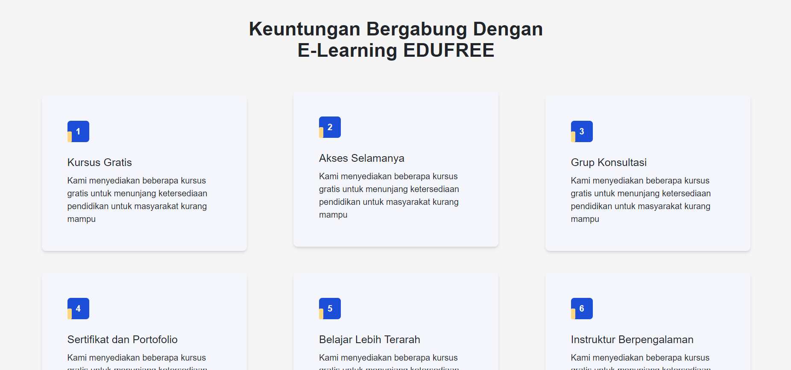

# E-learning Platform

A modern and responsive e-learning platform that provides courses in various fields. The platform offers a wide range of features, including testimonials, a Q&A section, and multiple informative pages for an enhanced user experience.

## Table of Contents

- [Features](#features)
- [Technologies](#technologies)
- [Installation](#installation)
- [Screenshots](#screenshots)
- [Usage](#usage)

## Features

- **Courses in different fields**: Users can browse and enroll in courses from various disciplines.
- **User Testimonials**: Real user feedback to help guide new learners.
- **Q&A Section**: A platform for users to ask questions and receive answers.
- **Multiple Pages**: Comprehensive and detailed sections, including About Us, Contact, and more.

## Technologies

- HTML
- CSS
- JavaScript
- React
- react-router
- Tailwind CSS

## Installation

To run this project locally:

1. Clone the repository:
```
git clone https://github.com/ayman-ezzeldin/E-Learning-App.git
```
2. Install the dependencies:
```
npm install
```
3. Start the development server:
```
npm run dev
```
## Screenshots

Here are some screenshots of the e-learning platform:

### Home Page


### Courses Page


### Testimonials Section


### Q&A Section


### Blogs Section


### About E-learning


## Usage

To start using the e-learning platform:

1. **Browse Courses**: Users can explore various courses in different fields directly from the homepage or courses page.

2. **Course Enrollment**: Select a course and view its details, including the curriculum, instructor, and testimonials.

3. **Interactive Q&A**: Visit the Q&A section to ask questions about specific topics or courses. Get answers from instructors or peers.

4. **View Testimonials**: Read feedback from users who have completed various courses, helping new users make informed decisions.

5. **Responsive Design**: The platform is fully responsive, ensuring that it works well on all devices, including desktops, tablets, and mobile phones.

